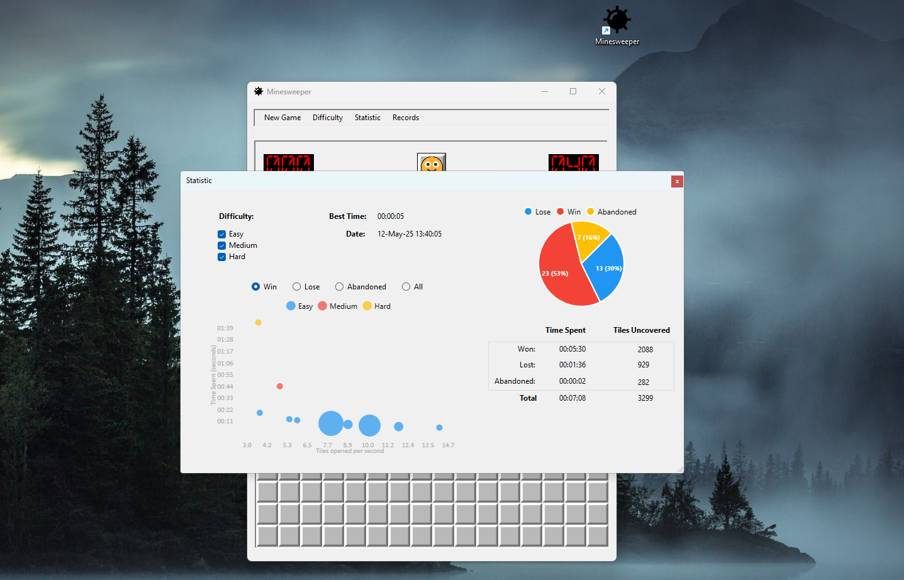
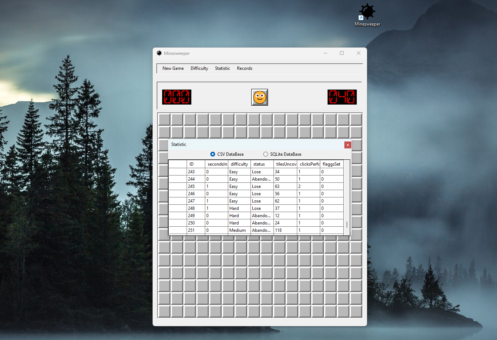

# 💣 Minesweeper (WinForms Game)

#### Recreation of the classic Minesweeper game, built using C# and WinForms.  
#### This project marks a major step forward in my learning journey — moving from console to graphical UI, integrating SQLite, applying layered architecture, and practicing design patterns with real-world tools.

---

  
*Menu navigation, difficulty selector, animated transitions*

---

## 🎯 Project Goals

+ Practice **WinForms development** with dynamic UI and layout control  
+ Implement **dependency injection** using `Microsoft.Extensions.DependencyInjection`  
+ Store and query player data using **SQLite**  
+ Visualize statistics with **LiveCharts**  
+ Apply **layered architecture**: Domain, Application, Infrastructure, UI  
+ Explore observer patterns and DTO usage in real-time UI updates  
+ Enable flexible difficulty settings, scalable UI, and responsiveness

---

## ✨ Features

+ 🔧 Difficulty selector with automatic grid scaling
+ 🧠 First-click safe logic and non-random solvable field generation
+ 🧮 Statistics tracking: wins, losses, time spent, tiles uncovered
+ 📊 Graphical analysis with LiveCharts (tiles/sec over time)
+ 💾 Game result saving to both local SQLite and optionally CSV
+ ✅ Smooth reveal behavior (hover, click-hold), smiley states, flag placement
+ 🧩 Modularized UI logic with custom renderers and service orchestration

---

## 🛠️ Technologies & Concepts Used

Concept | Description
---|---
WinForms UI | Fully dynamic grid generation using `TableLayoutPanel`, custom button styling
SQLite | Records persisted locally and queried with LINQ + parameterized SQL
Dependency Injection | Configured via `Program.cs` using `IServiceCollection`
DTOs & ViewModels | Used to decouple UI from domain entities (e.g., `CellView`)
Observer Pattern | Game updates pushed to UI via `ICellObserver`
LiveCharts | Used for visualizing game performance with `ScatterSeries`
Layered Architecture | Separated projects: Domain, Application, Infrastructure, UI

---

## 📦 Project Structure Overview

```plaintext
/Minesweeper.Domain
    ├── Entities          // Cell, Difficulty, Status, etc.
    └── Game Logic        // Core rules and behavior (e.g. Grid, Engine)

/Minesweeper.Application
    ├── Interfaces        // IGameService, ICellObserver, IChartService
    ├── DTOs              // CellView, GameStatsDto, etc.
    └── Services          // GameStateManager, Mappers

/Minesweeper.Infrastructure
    ├── Persistence       // SQLite access, CSV loading, connection string logic
    └── Configuration     // Settings loader, user preferences

/Minesweeper.WinForms
    ├── UI                // MainWindow, layout forms
    ├── Renderers         // ButtonRenderer, ChartRenderer
    └── Builders          // GridBuilder, MenuBuilder

Program.cs               // App startup and DI configuration
Assets/                  // Images, icons, fonts, animations
```

---

## 🚀 How to Run

You need [.NET 8.0 SDK](https://dotnet.microsoft.com/en-us/download/dotnet/8.0) and Visual Studio (WinForms workload):

```bash
git clone https://github.com/RustamKholov/Minesweeper.git
cd Minesweeper
dotnet build
dotnet run --project Minesweeper.WinForms
```

---

## 📸 Preview

### 💣 Main Gameplay


### ✅ Difficulty selector & grid scaling


### 🏆 Game stats and chart view


### 💾 Save records and analyze performance


---

## 🚀 My Learning Journey

This project continuing my studies after finishing [Snake](https://github.com/RustamHolov/Snake).  
Since then, I've explored:

- WinForms UI patterns
- Real-time rendering tricks
- Event-to-UI communication
- Data persistence and querying
- Charting and UI scaling

This Minesweeper game reflects my growing ability to structure larger apps with clearer architecture and separation of concerns. It also sets the stage for more advanced goals:

---

## 🔮 Next Steps

- [ ] Full MVVM separation for better testability
- [ ] Online score sharing & login system
- [ ] Unity or Avalonia port
- [ ] Algorithmically solvable board generation
- [ ] Puzzle mode with curated levels

---

## 🙌 Thanks for Reading

Stay tuned.  
👉 **Follow my progress**:  
GitHub: [RustamHolov](https://github.com/RustamKHolov)  
LinkedIn: [Rustam Kholov](https://www.linkedin.com/in/rustam-kholov/)
